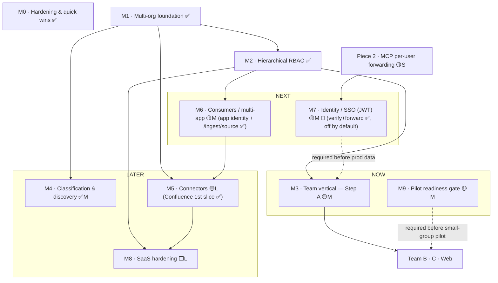

<!--
  k7e ROADMAP — living document.
  Update the status emoji + checkboxes as work lands. Keep "Immediate next action" current.
  Renders best on GitHub/editor (Mermaid diagram); the ASCII map below works in a terminal.
-->

# 🗺️ k7e Roadmap

> **What this is:** the single, living view of where k7e is and what to build next, in dependency order. Detailed designs live in `docs/superpowers/specs/`; step-by-step plans in `docs/superpowers/plans/`. This page is the map that ties them together.

**Status legend:** ✅ shipped · 🟡 designed (spec + plan ready) · ⬜ planned (needs its own spec) · 🔒 blocked · 🔁 cross-cutting
**Effort:** S = ≤1 day · M = a few days · L = 1–2 weeks+

---

## At a glance — Now / Next / Later

| Horizon | Milestones | Why now |
|---|---|---|
| **▶ Now** | `M3` Team vertical · `M9` Pilot readiness gate | M0 + M1 + M2 shipped; M3 (Team vertical) is the next real feature on the RBAC foundation; M9 items are cheap/independent, do them in parallel |
| **⏭ Next** | `M3` Team vertical (Step A) · `M7` Identity/SSO | First real multi-tenant value; production gate |
| **⏳ Later** | `M4` Classification · `M5` Connectors · `M6` Consumers/multi-app · `M8` SaaS hardening | Scale & breadth, gated on the foundation |

---

## ✅ Where we are today (shipped baseline)

- **Ingestion pipeline** — Temporal `IngestWorkflow` (load → redact → okf_ingest (compile) → mirror → lint). Autonomous v2: **no gate, no review, no Tier-A/B branch** (see `workflows.py`). OKF v2 git bundle is canonical, Postgres is the index.
- **Retrieval** — hybrid search (keyword + **pgvector** SQL cosine + recency + graph-importance) with 1-hop graph expansion; `/search` `/items` `/graph` `/lint` `/ingest`.
- **Vector search** — pgvector shipped (migration `0014`, exact cosine in SQL + HNSW index).
- **Permission-aware retrieval — Piece 1** — group filtering merged (`b3b9986`); the `AuthorizationService` seam is wired into every read path.
- **Embeddings** — `text-embedding-3-small` (1536-dim; LiteLLM alias `wiki-embed`), verified working end-to-end.
- **Web** — React 19 SPA: Home / Items / ItemDetail / Upload / Graph / History / Lint.
- **MCP server** — `apps/mcp` ships `search_wiki` + `get_wiki_page` tools (stdio + streamable-http) over a **fixed** identity (`X-User-Id: chat-agent` / `reader`). This is the surface M7's "Piece 2" upgrades to per-user forwarding.
- **Alembic head:** `0016_tenant_columns_backfill` (M1 Phase 1 shipped).
- **Multi-org foundation (M1) — shipped** — `Organization → Space → Project` tables (migration `0015`); `org_id` seam on every tenant-scoped table + backfill to `default`/`engineering` (migration `0016`); `scoped()` helper + `TenantContext` in `tenancy.py`; all 5 routers + `mirror_bundle` wired through the seam; cross-tenant isolation tests + un-scoped-query guard. Zero behavior change at one tenant. Branch: `feat/m1-multi-org-foundation`.
- **Personal spaces + private conversations — shipped** — space-targeted ingest (`space=` on upload, optional `team` on `POST /ingest/conversation`), JIT personal spaces (bare `Space.owner_user_id`, no Team/group), per-space OKF bundles as the actual privacy boundary, an implicit `user:<id>` self-group in RBAC, and a `space` filter on `/search`/`/items`. See M7 below for details and the deviation from the base spec.

---

## Dependency map



**ASCII fallback (terminal):**
```
M0 hardening ───(independent, do anytime)
M9 pilot readiness gate ───(independent, do anytime; required before small-group pilot)
M1 foundation seam ──► M2 RBAC ──► M3 Team Step A ──► B · C · Web
                          │                ▲                 ▲
                          └─► M6 consumers │  M7 Identity/SSO │ M9 (parallel,
M1 ─► M4 classification         │          │   required before prod data)
M1 ─► M5 connectors ◄── M6      └─► M8 SaaS hardening (needs real external org)
```

---

## Milestones

### ✅ M0 — Hardening & quick wins  · effort S · deps: none · **SHIPPED** (merged to `develop`)
Independent safety/perf wins surfaced in the optimization + security audits.
- [x] Added missing indexes: `knowledge_items.status`, `knowledge_items.current_version_id`, `wiki_chunks.item_id` (migration `0018`).
- [x] Auth semantics locked: derived page with empty `provenance.source_pages` stays public (`all([]) == True`) — decided **keep public** (a derived page with no restricted sources is public) + regression test on both authz services.
- [x] Auth hardening: `dev`/`reviewer` default identity env-gated — prod missing-headers → **anonymous** (fail-closed); the `dev`-user review/write backdoor gated behind `env == "dev"` across all 3 authz services.
- [x] Perf: embedding-client singleton in `deps.py`.
> **Acceptance:** ✅ indexes live (migration `0018`, head); ✅ empty-provenance semantics locked by test; ✅ prod fails closed on missing headers, no `dev` backdoor outside dev; ✅ 376 passed, 4 skipped (zero regressions). Deferred: DB-pool tuning for prod (config-only, do at deploy time).

### ✅ M1 — Multi-org foundation (the seam)  · effort M · deps: none · **SHIPPED** (branch `feat/m1-multi-org-foundation`)
`Organization → Space → Project` + `org_id` on every tenant table + one `scoped()` helper; backfill the existing corpus into `default`/`engineering`. **Zero behavior change at one tenant.**
- [x] Migrations `0015` (Org/Space/Project) + `0016` (tenant columns + backfill).
- [x] `tenancy.py` `scoped()` seam + `TenantContext`; route items/search/graph/ingest/lint through it.
- [x] Per-space OKF bundle stamping; cross-tenant isolation test.
- [x] Fix: `record_ingest_run` stamps `org_id` (caught in final review); legacy v1 write paths flagged for Phase 5.
> **Spec:** `…/specs/2026-06-29-multi-org-knowledge-platform-design.md` · **Plan:** `…/plans/2026-06-29-multi-org-knowledge-platform-roadmap.md` (Phase 1)
> **Acceptance:** ✅ existing suite green (306 passed, 2 skipped — was 274+1, zero regressions); ✅ org A never sees org B's rows (red-green-verified isolation tests); ✅ Alembic head `0016`; ✅ Postgres round-trip clean. Known Phase 5 follow-ups: tighten `scoped()` from `OR org_id IS NULL` to strict equality; scope `_resolve_provenance` + legacy v1 write paths; per-space same-slug schema change.

### ✅ M2 — Hierarchical RBAC  · effort M · deps: M1 · **SHIPPED** (branch `feat/m2-hierarchical-rbac`)
`RoleGrant` over `user`/`group`/`app` principals + `HierarchicalRbacAuthorizationService` (downward inheritance; `viewer<editor<reviewer<admin`), behind the existing seam. `allowed_groups` demoted to a per-page override.
- [x] `RoleGrant` table + migration `0017` + resolution; seeded all-org `group:public viewer` grant (behavior-preserving cutover).
- [x] `HierarchicalRbacAuthorizationService` (6-step resolver: grants → covered scopes → items → `allowed_groups` override → derived most-restrictive → set); `auth_mode="rbac"` default.
- [x] `can_write` / `can_review(scope)` by role; write-path gating (`editor` for ingest/archive, `reviewer` for lint) with `X-User-Roles` back-compat.
> **Spec:** `…/specs/2026-06-30-hierarchical-rbac-design.md` · **Plan:** `…/plans/2026-06-30-hierarchical-rbac.md`
> **Acceptance:** ✅ 363 passed, 3 skipped (M1 baseline 306+2 → +57 tests, zero regressions); ✅ behavior-preserving cutover proven (existing suite green under `auth_mode="rbac"`); ✅ fail-closed + no derived-source leak (truth-table verified); ✅ Alembic head `0017`; ✅ Postgres round-trip clean. Known follow-ups (deferred): `app`-principal wiring (M6); ReBAC swap (M8); SQL scope-pushdown; `scoped()` tightening (Phase 5); minor `can_write` divergence in the legacy `groups` mode (inert under `rbac` default).

### 🟡 M3 — Team vertical (Team Knowledge & Sharing)  · effort M · deps: M1 + M2
The first real product feature on the foundation. **Team = managed member-group + a private Space + a group grant.**
- [x] **Step A** — `Team`/`Membership` models, provisioning (team + space + grant atomically), `/teams` + membership API.
- [x] **Step B** — `Space.visibility=members` resolution (member sees team items; others don't).
- [x] **Step C** — `POST /ingest/conversation` — team-membership-gated Tier-B conversation ingest over the M6 generic path (the chat-agent "save to team" push itself is ~2–3 days in the chat-agent repo, out of scope here).
- [x] **Web** — k7e `/teams` UI (create, manage members/roles).
> **Spec:** `…/specs/2026-06-29-team-knowledge-sharing-design.md` · **Plan:** `…/plans/2026-07-02-m3-team-step-a-b.md` (Step A+B; supersedes the 2026-06-29 roadmap); Web: `…/plans/2026-07-02-m3-team-web-ui.md`
> **Acceptance (Step A+B ✅):** 396 passed, 5 skipped; migration `0019` + Postgres round-trip clean; members auto-share within a team (member sees team items via `/items`); removing a member cuts access on the next request (per-request resolution, no cached grant); non-members see nothing; derived most-restrictive rule holds across the team boundary. Branch: `feat/m3-team` (4 commits). **Known follow-ups (not blocking):** `remove_member` has no owner-removal guard (admin/owner self-remove can leave a team with no admin grant → permanently unmanageable; the Web UI mitigates self-lockout by hiding the self-remove control, but the backend guard is still pending); `viewer`/`owner` Membership roles don't affect the team-group editor grant (everyone gets editor); `M7` (JWT) remains the production gate before real team data.
> **Acceptance (Web ✅):** `/teams` (list + create) and `/teams/:slug` (members table + owner/admin management) shipped on branch `feat/m3-team-web`; added `GET /teams` (member/org-scoped list); duplicate slug on `POST /teams` now returns `409` (was 500); 61 web tests pass, full `pytest` 400 passed / 5 skipped.
> **Acceptance (Step C ✅):** `POST /ingest/conversation` shipped on `develop` (4 commits, FF-merged): resolves team by `(org_id, slug)` → 404, membership-gated (403, fail-closed for anonymous/non-member — a direct `is_team_member` check, no `get_authz` backdoor), stamps a Tier-B `chat_agent` `RawDocument` (`allowed_groups=[team:slug]`, `org_id`, `participants`/`captured_at` in `extra_metadata`) and starts the existing `IngestWorkflow`; idempotent **per-org** on `(source_system, thread_id, hash)`. Reuses `ingest_document` (extended: `FetchedDocument.extra_metadata` + existing-id on skip) and a shared `is_team_member` helper. Holistic review caught + fixed a **cross-tenant idempotency leak** (org-scoped `_latest_raw`) and bounded inputs (over-long `source_external_id`/`content` → 422, not a Postgres 500). Full `pytest` 553 passed / 7 skipped; **no migration**. Spec `…/specs/2026-07-06-m3-step-c-conversation-ingest-design.md`, plan `…/plans/2026-07-06-m3-step-c-conversation-ingest.md`. **Follow-ups:** high-volume claim extraction stays deferred (claims-at-scale); pre-existing `GET /ingest/status/{id}` is unauthenticated/unscoped and should be gated before prod; the JWT `sub` must share the `Membership.user_id` namespace before enabling JWT.

### 🟡 M7 — Identity / SSO (JWT)  · effort M · deps: Piece 2 · 🔁 parallel · **production gate**
SSO already exists (Okta → developer-portal JWT). k7e **verifies** that token (pluggable trusted issuers); consumers **forward** it. Header `X-User-*` stays the dev seam.
- [x] **JWT verification in k7e** — `jwt_auth.verify_token` (RS256 via JWKS, cached + fail-closed; HS256 shared-secret dev/test mode); `get_principal` gains a Bearer branch ahead of the header seam (`jwt_enabled` **off by default**; prod+enabled ignores `X-User-*` for identity; invalid→401, JWKS-outage→503). Roles/teams stay DB-resolved (token carries `sub` only) — a verified JWT flows straight into the existing `get_principal_with_teams` → RBAC, so a user sees public ∪ their teams with zero M2/M3 changes.
- [x] **Piece 2 — MCP per-user forwarding** — the MCP client relays the incoming `Authorization` (else env identity); the server reads the request's `Authorization` per tool call and forwards it (verifies nothing). Verified end-to-end against the real FastMCP SDK (Context is runtime-injected; the header reaches the API).
- [x] **Web SSO — the SPA becomes a consumer** — trusted-issuer **list** (`JWT_TRUSTED_ISSUERS` JSON; route by unverified `iss` → full per-issuer JWKS verify; legacy single `jwt_*` folds in, empty-issuer wildcard preserved) + `jwt_identity_claim` (global + per-issuer; missing claim → 401, never a silent `sub` fallback); `jwt_dev_secret` hard-guarded to `env=dev` (warn-once otherwise); web login layer (`apps/web/src/auth/`): `VITE_AUTH_MODE` = `dev` (default, byte-identical headers) | `oidc` (Auth Code + PKCE via lazy-chunked oidc-client-ts, `VITE_OIDC_SEND=id_token` Okta hedge) | `handoff` (dev-portal front-door, fragment token + single-use state; `scripts/dev_handoff_stub.py` = executable contract); Bearer on every request, debounced 401 → re-login; `CURRENT_USER_ID` retired for `useAuth()`. `JWT_*`/`VITE_AUTH_*` in `.env.example` + compose/Dockerfile build args. Spec `…/specs/2026-07-06-web-sso-login-design.md`.
- [x] **Personal spaces + private conversations** — space-targeted ingestion: `POST /ingest/upload` gains an optional `space=` form field and `POST /ingest/conversation`'s `team` becomes optional; both stamp `RawDocument.space_id`/`created_by`. `space=personal` (or an absent `team`) resolves to the caller's **personal space** — a bare `Space` (`owner_user_id` set, no Team/Membership/group) **JIT-provisioned** on first use (`personal_spaces.py`: idempotent, direct editor+admin grants for the owner, race-safe). The worker compiles space-targeted docs into **per-space OKF bundles** (`okf_bundles_root/<slug>/`, `okf_activities._bundle_for`) instead of the shared default bundle — this is the real privacy boundary: OKF compose only ever merges knowledge within one bundle, so personal/team-private content structurally cannot surface in another space's derived entity/concept pages, independent of RBAC. Personal ingest is capped (`personal_ingest_daily_cap`, default 20/day) and gated by `require_verified_identity` (outside `env=dev`, only a JWT-verified principal may target `personal` — an unverified header caller can't ingest into someone else's identity). A `space` filter on `GET /search`/`GET /items` narrows (never widens, no JIT) results to one space, including `space=personal`.
  **Deviation from the base spec (decided at planning):** personal items are additionally stamped `allowed_groups=["user:<id>"]`, admitted via a new implicit `user:<id>` self-group in RBAC's `allowed_groups` intersection (`rbac.effective_groups`) — space grants alone can't hide them, because the seeded `group:public viewer@org` grant admits every org item at the resolver's derived-visibility step regardless of space. Consequence: an org admin retains **lifecycle** control over a personal space (their admin `RoleGrant` can still delete it) but does **not** gain **read** access to its content. Recorded in the addendum spec.
> **Spec:** `…/specs/2026-07-06-personal-spaces-design.md` (base) + `…/specs/2026-07-08-sso-enablement-personal-conversations-design.md` (addendum) · **Plan:** `…/plans/2026-07-08-personal-spaces-conversations.md`
> **Acceptance:** `full pytest` 652 passed / 9 skipped (from the 585/8 baseline at plan time); `ruff check` clean; migration `0024` (`spaces.owner_user_id`, `raw_documents.space_id`/`created_by`, partial-unique one-personal-space-per-user index); web unaffected (backend-only slice, 103 web tests still pass). Branch: `feat/personal-spaces` (12 commits off `develop`).
- [ ] **Before flipping `jwt_enabled=on`** (follow-ups) — wrap MCP client 401/403 as a clean "session expired — re-login" tool error; the open-chat repo change (forward the user's JWT — interface only, its own repo); the dev-portal handoff endpoint (its repo; contract = `dev_handoff_stub.py`); **seed `RoleGrant` rows for real users** (logged-in ≠ authorized — JWT principals have no roles until granted); confirm the identity claim lands in the `Membership.user_id` namespace (`jwt_identity_claim=email` is the hedge). **Also deferred:** PATs (non-interactive callers) — a `wiki_pat_…` branch slots into `get_principal` later, no rework.
> **Spec:** `…/specs/2026-07-02-mcp-per-user-identity-design.md` (revalidated 2026-07-06) · web SSO `…/specs/2026-07-06-web-sso-login-design.md` · **Plans:** `…/plans/2026-07-06-m7-jwt-identity-mcp-forwarding.md`, `…/plans/2026-07-06-web-sso-login.md`
> **Acceptance (✅ built, off by default):** `full pytest` 542 passed / 7 skipped; ruff clean; principal-from-token matrix (valid→`sub`, expired/bad-sig/wrong-iss/wrong-aud/missing-sub/no-exp→401, JWKS-outage→503, prod+enabled `X-User-Roles: admin`→nothing); RS256 verified via a local keypair + static JWKS (no network); MCP forwarding verified on the real SDK. `jwt_enabled` defaults **off** → behavior byte-identical to today until turned on. Branch: `feat/m7-jwt-identity` (6 commits). **Must be enabled before M3 carries real team data in production — real team data only behind a verified JWT, never header-trust.**
> **Acceptance (web SSO ✅, off by default):** full pytest 576 passed / 7 skipped, ruff clean; web 99 tests + `npm run build` (tsc + vite) clean, oidc-client-ts in a lazy chunk; dev-mode request headers locked byte-identical by test; multi-issuer matrix (per-issuer JWKS/aud, cross-signed/unknown/missing iss → 401, legacy fold + wildcard preserved); smokes: `mint_dev_jwt.py` → `verify_token` (dev OK, prod rejects), `dev_handoff_stub.py` 302 contract (fragment token verifies, state echoed, bad origin → 400). Branch: `feat/web-sso`.

### ✅ M4 — Classification & discovery  · effort M · deps: M1 · **SHIPPED**
Governed `domain` enum + free-form `tags` (classification ≠ containment); faceted search/graph filters; formalized OKF front-matter schema.
- [x] **Backend slice** — governed `domain` (fixed 9-value enum in `okf.py`, LLM-assigned at extraction + enum-coerced) as an indexed `knowledge_items.domain` column; free-form `tags` promoted into a normalized `item_tags` table by the mirror (backfills existing pages for free); `domain`/`tag` faceted filters on `/items`, `/search`, `/graph`; new `GET /facets` (permission-scoped domain/tag/type counts); `domain_missing` lint rule; migration `0020`.
- [x] **Web discovery UI** — `ItemsPage` broadened into a faceted **Browse** surface: a `FacetBar` (domain single-select · tags multi-select AND · type, with `/facets` counts) over all published items; filters **synced to the URL** (`?q=&domain=&tag=&type=`, shareable/bookmarkable) narrow both browse and search; `ItemDetailPage` shows the page's domain/tags as chips linking back to the filtered browse. New `FilterChip`/`FacetBar` components.
> **Spec:** backend `…/specs/2026-07-03-m4-classification-facets-backend-design.md` · web `…/specs/2026-07-03-m4-web-faceted-discovery-design.md` · **Plans:** `…/plans/2026-07-03-m4-classification-facets-backend.md`, `…/plans/2026-07-03-m4-web-faceted-discovery.md`
> **Acceptance (Backend ✅):** `full pytest` 439 passed / 6 skipped; migration `0020` (add `knowledge_items.domain` + `item_tags`) Postgres up/down/up round-trip clean (+ gated round-trip test); classification is orthogonal to containment; every filter + facet count is permission-scoped (`allowed_item_ids ∩ scoped(published)`) and can only narrow. Branch: `feat/m4-classification` (10 commits).
> **Acceptance (Web ✅):** `apps/web` 77 tests pass, `npm run build` (tsc + vite) clean; URL is the single source of truth (shareable filtered views); `type` is browse-only (hidden during search, since `/search` has no type). Branch: `feat/m4-web` (6 commits).
> **Known follow-ups (not blocking):** (1) shared derived (`entity`/`concept`) pages get their `domain`/`tags` overwritten last-write-wins across sources (pre-existing `tags` behavior; M4 extends it to `domain`) — union/preserve in `okf_ingest._merge_existing`; the `domain_missing` lint deliberately scopes to source pages for this reason. (2) Web polish: the search-box text doesn't resync from the URL on browser back/forward (filters + results do), and the nav label still reads "Items" vs the "Browse" heading.

### 🟡 M5 — Connectors  · effort L · deps: M1 (+ M2 for ACL hints; M6 only for *external* consumers)
`SourceConnector` framework + Confluence/Jira auto-ingest + per-space config + event triggers (Jira→Done, PR merge, scheduled crawl).
- [x] **internal wiki (Confluence) connector — first slice** — a credentialed `ConfluenceConnector` pulling one configured space's pages (Tier-A) via the Confluence REST API (HTTP client injected → fake-tested); a connector **registry** (`Space.connector_config` → connector, token from `.env`); **tenant-scoped ingest** (`ingest_document`/`run_connector` stamp `org_id` + config-default `allowed_groups`, closing the "Phase 5 TODO"); admin-gated **`POST /connectors/{space_slug}/sync`**. Runs in-process through the *same* `IngestWorkflow` as uploads — no M6/M7 needed.
- [ ] **Follow-ups** — multi-space fan-out; Temporal-Schedule auto-sync (24h crawl); Jira / other connectors; webhook/event triggers; confidential-label filtering; HTML→markdown cleanup; set `RawDocument.workflow_id` + mark `status="failed"` on workflow-start failure (match the upload path).
> **Spec:** `…/specs/(archived internal design — connector spec lives in docs/development/adding-connectors.md)` · **Plan:** `…/plans/(archived internal plan)`
> **Rationale:** the internal wiki is the highest-quality source (human-curated, org-wide, FAQ-structured, LLM-ready ground truth) — the highest-ROI first connector; service/region tagging comes free from M4, dedup from ingest idempotency, confidential-filtering from `allowed_groups`.
> **Acceptance (first slice ✅):** `full pytest` 497 passed / 6 skipped; ruff clean; connector→registry→endpoint→`run_connector`→tenant-stamped `RawDocument`→**same `IngestWorkflow` as uploads** verified end-to-end (incl. a regression test that runs a real async workflow starter through the sync route). Secrets only in `.env` (config split by secrecy). Branch: `feat/m5-connector` (6 commits).

### 🟡 M6 — Consumers / multi-app API  · effort M · deps: M2 (app principal)
`ClientApp` registry (first-class `app` principal); **delegated** (on-behalf-of-user) + **service-identity** (autonomous) modes; one consumer-agnostic `/ingest/source` API; pluggable trusted issuers. Makes chat-agent "Consumer #1," not a special case.
- [x] **App identity + `/ingest/source` (service-identity) — first slice** — a `ClientApp` registry (`client_apps`, migration `0021`; `POST/GET /apps` org-admin provisioning, one-time `X-App-Key`, only the sha256 hash stored, seeds a default `editor@org` grant); `X-App-Key` auth → `Principal(kind="app")` with the RBAC resolver made **kind-aware** (activates the reserved `principal_kind="app"`; dev-backdoor guarded off for apps); consumer-agnostic **`POST /ingest/source`** where a registered app ingests a text source **as itself**, write-gated by its own grant, through the *same* `IngestWorkflow` as uploads. In-process — no M7/JWT.
- [ ] **Follow-ups** — **delegated on-behalf-of-user + trusted-issuer JWT (→ M7)**; binary/multipart `/ingest/source` bodies; per-space targeting; an app-grant management API + key rotation/revocation; return the existing doc id on idempotent skip; the M3 Step C conversation shape (rides on `/ingest/source`).
> **Spec:** `…/specs/2026-07-06-m6-consumer-app-identity-ingest-source-design.md` · **Plan:** `…/plans/2026-07-06-m6-consumer-app-identity-ingest-source.md`
> **Acceptance (first slice ✅):** `full pytest` 519 passed / 7 skipped; ruff clean; migration `0021` (client_apps) additive + Postgres up/down/up round-trip clean (+ gated round-trip test). End-to-end verified: `X-App-Key` → app principal → real app-grant `can_write` → `ingest_document` → same `IngestWorkflow` as uploads. Secrets only in the sha256 hash (plaintext returned once, never logged); an app matches only its own `app` grants (no `public`/user/group inheritance, no dev backdoor); `source_tier` validated (clean 400). Branch: `feat/m6-app-identity` (8 commits).

### ⬜ M8 — SaaS hardening  · effort L · deps: M1–M5 + a real external org
Per-request `TenantContext` from token claims; Postgres RLS; optional DB-per-tenant; optional ReBAC engine swap; cross-org publishing; per-tenant config/quotas. **Trigger:** a committed external-org use case — not before.

### 🟡 M9 — Pilot readiness gate  · effort M · deps: none · parallelizable · **gates the small-group pilot**
Surfaced by the 2026-07-01 backbone/production-readiness audit. Independent items — do them anytime alongside `M0`/`M2` — but **all must close (or be explicitly deferred with rationale) before opening access to the first small external group**, per the "finish roadmap → requality-test → small-group pilot" plan.
- [ ] **OKF bundle durability** — the git bundle (`.data/okf-bundle`) is the canonical knowledge store (Postgres is explicitly a derived index rebuilt from it) and currently has no backup/replication story. Push to a remote git repo and/or snapshot the volume.
- [ ] **Rate limiting** — no throttling on `/ingest` or the MCP server today; add basic per-caller limits before either is reachable outside localhost.
- [ ] **CI dependency/security scanning** — add `pip-audit` (Python) and `npm audit` or Dependabot to CI; today CI checks correctness only, not supply-chain risk.
- [ ] **Alerting on existing metrics** — Prometheus series exist (`wiki_http_requests`, `wiki_ingest_total`, `wiki_review_queue_depth`, etc.) but nothing alerts on them; define alert rules for HTTP error rate, ingest failures, and stuck review queue depth.
- [ ] **A real deployment target** — only `docker-compose` exists today; define and document where this actually runs for the pilot (host + restart/update story — doesn't need to be Kubernetes).
- [ ] **Load/perf pass** — validate LLM-call latency and Postgres query performance under realistic small-group load; no such pass exists yet.
> **Housekeeping (not gating):** prune the stale `.claude/worktrees/{m1-multi-org, pgvector}` worktrees — both correspond to work already shipped/superseded.
> **Acceptance:** every item above closed or explicitly deferred with written rationale before the first external small-group user gets access.

---

## 🧭 Recommended sequence (critical path)

1. **`M0`** and **`M9`** in parallel from day one (cheap, independent; `M9` gates the small-group pilot).
2. **`M1` ✅ → `M2` ✅** — the foundation + RBAC are shipped and merged/ready.
3. **`M3` Step A → B → Web**, with **`M7`** running in parallel (gate `M3`'s production rollout on `M7`).
4. **`M3` Step C** once Step A + the generic ingest endpoint exist (chat-agent work in its own repo).
5. **`M4` / `M5` / `M6`** as breadth demands (all gated on `M1` ✅, some on `M2` ✅).
6. **`M8`** only when a real external org appears.
7. Once the roadmap above is executed, run a quality/re-test pass, then open access to the first small external group (gated on `M9` closing).

```
Day 0 ───────────────────────────────────────────────► time
  M0 ▓▓ (anytime, parallel)
  M9 ▓▓ (anytime, parallel; gates small-group pilot)
  M1 ✅ DONE ──► M2 ✅ DONE ──► M3 ▓▓▓▓ (A→B→Web) ──► M4/M5/M6 …
                               M7 ▓▓▓ (parallel, gates M3 prod)            M8 (later)
                                                                            pilot ▓ (gated on M9)
```

---

## ▶ Immediate next action

**M0 ✅, M1 ✅, M2 ✅, and M3 Step A+B+Web ✅ are all SHIPPED.** M0/M1 are merged to `develop`; M2 is on `feat/m2-hierarchical-rbac`; M3 Step A+B is on `feat/m3-team` (4 commits, 396 passed / 5 skipped, migration `0019` + Postgres round-trip clean); M3 Web is on `feat/m3-team-web` (`/teams` + `/teams/:slug` UI, 61 web tests pass, full `pytest` 400 passed / 5 skipped) — ready for review/merge.

**`M4` Classification & discovery — ✅ FULLY SHIPPED** (backend + web). Backend on `feat/m4-classification` (10 commits, `full pytest` 439 passed / 6 skipped, migration `0020` + Postgres round-trip clean): governed `domain` enum + queryable `tags` (normalized `item_tags`), faceted `domain`/`tag` filters on `/items` `/search` `/graph`, `GET /facets`, `domain_missing` lint rule. Web on `feat/m4-web` (6 commits, 77 web tests + `npm run build` clean): `ItemsPage` faceted **Browse** surface (domain/tags/type chips w/ counts, URL-synced filters), `ItemDetailPage` classification chips.

**`M3` is now functionally complete — Step A + B + Web + C all SHIPPED.** `M5` (Confluence connector), `M6` (`/ingest/source` app identity), and `M7` (JWT verification, off by default) also shipped on `develop`; chat-agent can now push conversations into a team Space via `POST /ingest/conversation`. **Before real team data in production:** gate the unauthenticated `GET /ingest/status/{id}`, land the chat-agent "save to team" push (its own repo, ~2–3 days), and flip `jwt_enabled` on (M7) after confirming the JWT-`sub` ↔ `Membership.user_id` namespace. **Next candidates:** the deferred **claims-at-scale** track (high-volume conversational auto-capture — spec `…/specs/2026-06-18-claims-at-scale-design.md`) and **`M9`** pilot-readiness items.

**Personal spaces + private conversations — ✅ SHIPPED** (under M7 above): space-targeted ingest, JIT personal spaces, per-space OKF bundles as the privacy boundary, an implicit `user:<id>` RBAC self-group, and a `space` filter on `/search`/`/items`. On `feat/personal-spaces` (12 commits off `develop`, `full pytest` 652 passed / 9 skipped, ruff clean, web unaffected) — verified, not yet merged.

- In parallel, knock out **`M9`** pilot-readiness items (OKF bundle backup, rate limiting, CI security scanning, alerting, deployment target, load testing) — all small and independent.
- Before opening access to the first small external group, confirm every `M9` item is closed or explicitly deferred.

> _Last reviewed: 2026-07-02. Update status markers + checkboxes as milestones land._
